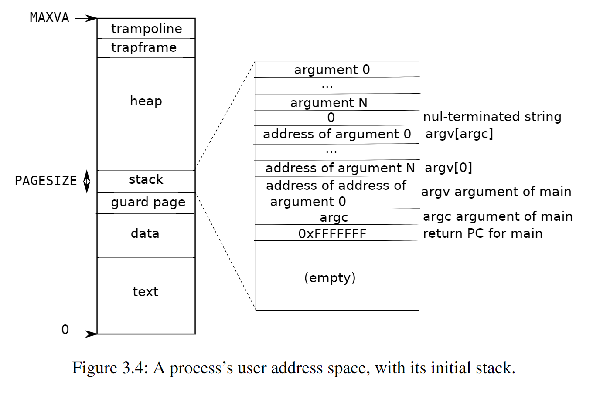

# Lab: page tables

## Speed up system calls (easy)

> 注意，这个题目是我他喵的看错了，进到了2022年的实验里，2020年没有这个实验。不过挺有意思的就做了。

Some operating systems (e.g., Linux) speed up certain system calls by sharing data in a read-only region between userspace and the kernel. This eliminates the need for kernel crossings when performing these system calls. To help you learn how to insert mappings into a page table, your first task is to implement this optimization for the getpid() system call in xv6.

> When each process is created, map one read-only page at USYSCALL (a virtual address defined in memlayout.h). At the start of this page, store a struct usyscall (also defined in memlayout.h), and initialize it to store the PID of the current process. For this lab, ugetpid() has been provided on the userspace side and will automatically use the USYSCALL mapping. You will receive full credit for this part of the lab if the ugetpid test case passes when running pgtbltest.


最开始考虑了半天在用户地址空间的哪里放这个USYSCALL，用户地址空间是这样的：



最后决定将它放在TRAPFRAME下面，给一个物理页大小：

```diff
// kernel/memlayout.h
#define TRAPFRAME (TRAMPOLINE - PGSIZE)
+#define USYSCALL  (TRAPFRAME  - PGSIZE)
```

在proc.c的`proc_pagetable`函数中，分配一个物理页并创建这一映射：

```diff
// kernel/proc.c
pagetable_t
proc_pagetable(struct proc *p)
{
  pagetable_t pagetable;

  // An empty page table.
  pagetable = uvmcreate();
  if(pagetable == 0)
    return 0;

  // ...

+  struct usyscall *usyscall_ptr = kalloc();
+  usyscall_ptr->pid = p->pid;
+
+  // map the USYSCALL just below TRAPFRAME
+  if (mappages(pagetable, USYSCALL, PGSIZE,
+              (uint64) usyscall_ptr, PTE_R | PTE_U) < 0) {
+    uvmunmap(pagetable, USYSCALL, 1, 0);
+    uvmfree(pagetable, 0);
+    return 0;
+  }

  return pagetable;
}
```

在proc.c的`free_procpagetable`中unmap并释放物理页：
```diff
// Free a process's page table, and free the
// physical memory it refers to.
void
proc_freepagetable(pagetable_t pagetable, uint64 sz)
{
  uvmunmap(pagetable, TRAMPOLINE, 1, 0);
  uvmunmap(pagetable, TRAPFRAME, 1, 0);
+  uvmunmap(pagetable, USYSCALL, 1, 1);
  uvmfree(pagetable, sz);
}
```

我们自己提供一个`ugetpid`看看能不能用：
```c
#include "kernel/types.h"
#include "kernel/riscv.h"
#include "kernel/param.h"
#include "kernel/types.h"
#include "kernel/stat.h"
#include "user/user.h"
#include "kernel/memlayout.h"

int ugetpid() {
    struct usyscall *usc = (struct usyscall*)USYSCALL;
    return usc->pid;
}

int main() {
    printf("getpid: %d, ugetpid: %d\n", getpid(), ugetpid());

    if (fork() == 0) {
        printf("sub getpid: %d, ugetpid: %d\n", getpid(), ugetpid());
        exit(0);
    }

    wait(0);
    exit(0);
}
```

运行结果：
```
$ ugetpid
before call ugetpid...
getpid: 3, ugetpid: 3
sub getpid: 4, ugetpid: 4
```

> 之前忘了给USYSCALL页面添加PTE_U这个flag，导致一直报load page fault，卡了我一个小时。因为我看TRAPFRAME和TRAMPOLINE都没做，我以为我也不用做，后来想想那两个是在supervisor权限下，页表还没切换到内核页表时被读取和运行的，所以不用PTE_U。

## Print a page table (easy)

## A kernel page table per process (hard)

## Simplify copyin/copyinstr (hard)