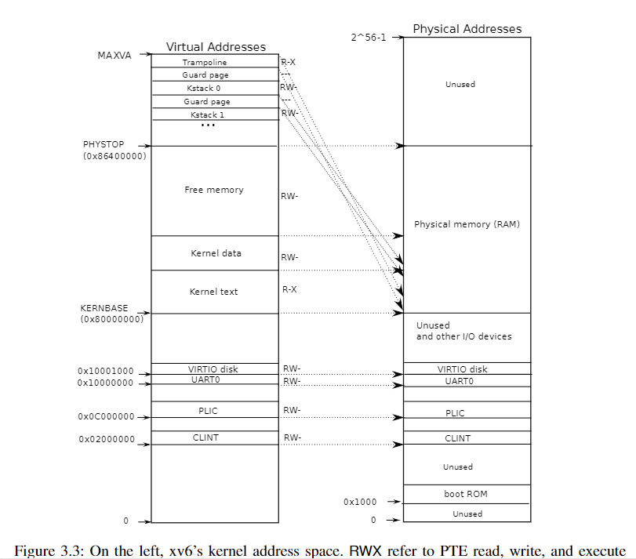

# Lab: Copy-on-Write Fork for xv6

Virtual memory provides a level of indirection: the kernel can intercept memory references by marking PTEs invalid or read-only, leading to page faults, and can change what addresses mean by modifying PTEs. There is a saying in computer systems that any systems problem can be solved with a level of indirection. The lazy allocation lab provided one example. This lab explores another example: copy-on write fork.

## The problem

The fork() system call in xv6 copies all of the parent process's user-space memory into the child. If the parent is large, copying can take a long time. Worse, the work is often largely wasted; for example, a fork() followed by exec() in the child will cause the child to discard the copied memory, probably without ever using most of it. On the other hand, if both parent and child use a page, and one or both writes it, a copy is truly needed.

## The solution

The goal of copy-on-write (COW) fork() is to defer allocating and copying physical memory pages for the child until the copies are actually needed, if ever.

COW fork() creates just a pagetable for the child, with PTEs for user `m`m`ory pointing to the parent's physical pages. COW fork() marks all the user PTEs in both parent and child as not writable. When either process tries to write one of these COW pages, the CPU will force a page fault. The kernel page-fault handler detects this case, allocates a page of physical memory for the faulting process, copies the original page into the new page, and modifies the relevant PTE in the faulting process to refer to the new page, this time with the PTE marked writeable. When the page fault handler returns, the user process will be able to write its copy of the page.

COW fork() makes freeing of the physical pages that implement user memory a little trickier. A given physical page may be referred to by multiple processes' page tables, and should be freed only when the last reference disappears.

## Implement copy-on write(hard)

> Your task is to implement copy-on-write fork in the xv6 kernel. You are done if your modified kernel executes both the cowtest and usertests programs successfully.

Here's a reasonable plan of attack.

- Modify uvmcopy() to map the parent's physical pages into the child, instead of allocating new pages. Clear PTE_W in the PTEs of both child and parent.
- Modify usertrap() to recognize page faults. When a page-fault occurs on a COW page, allocate a new page with kalloc(), copy the old page to the new page, and install the new page in the PTE with PTE_W set.
- Ensure that each physical page is freed when the last PTE reference to it goes away -- but not before. A good way to do this is to keep, for each physical page, a "reference count" of the number of user page tables that refer to that page. Set a page's reference count to one when kalloc() allocates it. Increment a page's reference count when fork causes a child to share the page, and decrement a page's count each time any process drops the page from its page table. kfree() should only place a page back on the free list if its reference count is zero. It's OK to to keep these counts in a fixed-size array of integers. You'll have to work out a scheme for how to index the array and how to choose its size. For example, you could index the array with the page's physical address divided by 4096, and give the array a number of elements equal to highest physical address of any page placed on the free list by kinit() in kalloc.c.
- Modify copyout() to use the same scheme as page faults when it encounters a COW page.

Some hints:

- The lazy page allocation lab has likely made you familiar with much of the xv6 kernel code that's relevant for copy-on-write. However, you should not base this lab on your lazy allocation solution; instead, please start with a fresh copy of xv6 as directed above.
- It may be useful to have a way to record, for each PTE, whether it is a COW mapping. You can use the RSW (reserved for software) bits in the RISC-V PTE for this.
- usertests explores scenarios that cowtest does not test, so don't forget to check that all tests pass for both.
- Some helpful macros and definitions for page table flags are at the end of kernel/riscv.h.
- If a COW page fault occurs and there's no free memory, the process should be killed.

### 准备工作

下图是RISC-V的PTE结构，第8、9、10位可以被我们利用，以识别一个页是否是COW页：


定义标记COW所要用到的位，以及如何通过物理地址计算其物理页所在的物理页号引用计数数组索引：

```c
// kernel/riscv.h
#define PTE_COW (1L << 8)
#define PA2IDX(pa) (((uint64)(pa) - KERNBASE) / PGSIZE)
```



定义引用计数数组：
```c
// kernel/kalloc.c
char phypage_rc[PA2IDX(PHYSTOP)+1];
```

### 修改kalloc和kfree

我们要做的第一步是修改kalloc和kfree，让它们和引用计数数组一起工作。引用计数数组是内核中一个新的全局数据结构，会被并发访问，应该给它来把锁：

```c
// kernel/kalloc.c
char phypage_rc[(PHYSTOP - KERNBASE) / PGSIZE] = {0};
struct spinlock phypage_rclock;

void
kinit()
{
  initlock(&kmem.lock, "kmem");
  // 初始化锁
  initlock(&phypage_rclock, "phypage_rc");
  memset(phypage_rc, 1, sizeof(phypage_rc));
  freerange(end, (void*)PHYSTOP);
}
```

> 注意，xv6会认为所有物理内存页都是未释放的，所以我们应该将`phypage_rc`中每个页全都初始化为1，后面的`freerange`会将所有页free一遍。

然后，修改kalloc和kfree：
```c
// kernel/kalloc.c
void *
kalloc(void)
{
  struct run *r;

  acquire(&kmem.lock);
  r = kmem.freelist;
  if(r) {
    kmem.freelist = r->next;
    // 在kalloc返回前，这个物理地址不会被并发使用，所以无需加锁
    phypage_rc[PA2IDX((uint64)r)]=1;
  }
  release(&kmem.lock);

  if(r)
    memset((char*)r, 5, PGSIZE); // fill with junk
  return (void*)r;
}
```

kfree只在引用计数为1时清空物理页
```c
// kernel/kalloc.c
void
kfree(void *pa)
{
  struct run *r;

  if(((uint64)pa % PGSIZE) != 0 || (char*)pa < end || (uint64)pa >= PHYSTOP)
    panic("kfree");

  acquire(&phypage_rclock);
  int rc = phypage_rc[PA2IDX((uint64)pa)];
  phypage_rc[PA2IDX((uint64)pa)]--;

  if (rc == 1) {
    // Fill with junk to catch dangling refs.
    memset(pa, 1, PGSIZE);

    r = (struct run*)pa;

    acquire(&kmem.lock);
    r->next = kmem.freelist;
    kmem.freelist = r;
    release(&kmem.lock);
  }

  release(&phypage_rclock);
}
```

### 修改`uvmcopy`
下面可以开始进入COW功能的开发了，`fork`会调用`uvmcopy`将父进程的页表复制给子进程：

```c
// kernel/proc.c   fork()

// Copy user memory from parent to child.
if(uvmcopy(p->pagetable, np->pagetable, p->sz) < 0){
    freeproc(np);
    release(&np->lock);
    return -1;
}
```

我们需要修改`uvmcopy`的行为，取消实际复制，只是将物理页计数器加1，并将PTE修改为不可写，加上COW标记，让usertrap可以识别它：

```c
int
uvmcopy(pagetable_t old, pagetable_t new, uint64 sz)
{
  pte_t *pte;
  uint64 pa, i;
  uint flags;
  // char *mem;

  for(i = 0; i < sz; i += PGSIZE){
    if((pte = walk(old, i, 0)) == 0)
      panic("uvmcopy: pte should exist");
    if((*pte & PTE_V) == 0)
      panic("uvmcopy: page not present");
    pa = PTE2PA(*pte);
    flags = PTE_FLAGS(*pte);

    flags &= ~PTE_W;  // 取消 PTE_W 标记
    flags |= PTE_COW; // 添加PTE_COW标记

    // 取消实际物理内存的分配
    // if((mem = kalloc()) == 0)
    //   goto err;
    // memmove(mem, (char*)pa, PGSIZE);

    // 父子映射相同的物理页，并增加引用计数
    if(mappages(new, i, PGSIZE, pa, flags) != 0){ 
      goto err;
    }
    *pte = PA2PTE(pa) | flags;
    // 别忘了老页表的pte也应该更新
    acquire(&phypage_rclock);
    phypage_rc[PA2IDX(pa)]++;
    release(&phypage_rclock);
  }
  return 0;

 err:
  uvmunmap(new, 0, i / PGSIZE, 1);
  return -1;
}
```

鄙人想，这个代码应该没啥问题吧...也许???可能???

### 修改usertrap，以响应COW页的读事件

usertrap如果发现写错误，并且错误页面是一个COW页面的话，它需要创建一个新页面，将旧物理页的内容复制过去，并递减原物理页的引用计数。

```c
// kernel/trap.c   usertrap
  } else if(r_scause() == 15) {
    uint64 va = PGROUNDDOWN(r_stval());
    pte_t *pte = walk(myproc()->pagetable, va, 0);
    uint64 flag = PTE_FLAGS(*pte);
    if (flag & PTE_COW) {
      flag |= PTE_W;
      flag &= ~PTE_COW;
      void *new_pa = kalloc();
      if (new_pa != 0) {
        uint64 ori_pa = PTE2PA(*pte);
        memmove(new_pa, (void*)ori_pa, PGSIZE);
        *pte = PA2PTE(new_pa) | flag;
        kfree((void*)ori_pa);
      } else {
        printf("usertrap(): unexpected scause %p pid=%d\n", r_scause(), p->pid);
        printf("            sepc=%p stval=%p\n", r_sepc(), r_stval());
        p->killed = 1;
      }
    }
  }
```

鄙人想，应该也没啥问题吧？？？？

### 修改copyout，当遇到COW页时创建新页

copyout和usertrap中都需要判断va是否是COW页，若是的话就映射，我们抽取出一个`try_cow`函数：
```c
/**
 * 该函数将判断va映射的物理页是否是一个cow页，如果是就尝试创建一个新页并映射，维护好引用计数
 * 如果不是cow页，返回0
 * 如果过程中出错，返回-1
 * 成功，返回1
*/
int try_cow(pagetable_t pgtbl, uint64 va) {
  if (va >= MAXVA) return -1;
  pte_t *pte = walk(pgtbl, va, 0);
  if(pte == 0 || (*pte & (PTE_V)) == 0 || (*pte & PTE_U) == 0) return -1;  
  uint64 flag = PTE_FLAGS(*pte);
  if (flag & PTE_COW) {
    flag |= PTE_W;
    flag &= ~PTE_COW;
    void *new_pa = kalloc();
    if (new_pa == 0) return -1;

    uint64 ori_pa = PTE2PA(*pte);
    memmove(new_pa, (void*)ori_pa, PGSIZE);
    *pte = PA2PTE(new_pa) | flag;
    kfree((void*)ori_pa);
    return 1;
  } else {
    return 0;
  }
}
```

```c
// kernel/trap.c   usertrap()
  } else if(r_scause() == 15) {
    int ret = try_cow(myproc()->pagetable, r_stval());
    if (ret <= 0) {
      if (ret == 0) {
        printf("usertrap(): unexpected scause %p pid=%d\n", r_scause(), p->pid);
        printf("            sepc=%p stval=%p\n", r_sepc(), r_stval());
      }
      p->killed = 1;
    }
  
```

```c
// kernel/vm.c
int
copyout(pagetable_t pagetable, uint64 dstva, char *src, uint64 len)
{
  uint64 n, va0, pa0;

  while(len > 0){
    va0 = PGROUNDDOWN(dstva);
    // 尝试cow
    if (try_cow(pagetable, va0) < 0) return -1;
    pa0 = walkaddr(pagetable, va0);
    if(pa0 == 0)
      return -1;
    n = PGSIZE - (dstva - va0);
    if(n > len)
      n = len;
    memmove((void *)(pa0 + (dstva - va0)), src, n);

    len -= n;
    src += n;
    dstva = va0 + PGSIZE;
  }
  return 0;
}
```

> 妈的，我调了一个多小时的错误，后来发现我`try_cow`的返回值是`uint64`，然后我还用负数作为返回值的状态，导致`try_cow`永远不会发现自己失败。

