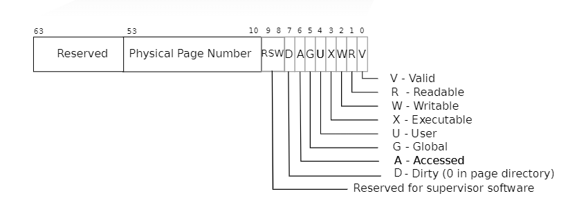

# Lab: traps

## RISC-V assembly (easy)
It will be important to understand a bit of RISC-V assembly, which you were exposed to in 6.004. There is a file user/call.c in your xv6 repo. make fs.img compiles it and also produces a readable assembly version of the program in user/call.asm.

Read the code in call.asm for the functions g, f, and main. The instruction manual for RISC-V is on the [reference page](https://pdos.csail.mit.edu/6.S081/2020/reference.html). Here are some questions that you should answer (store the answers in a file answers-traps.txt):

> Which registers contain arguments to functions? For example, which register holds 13 in main's call to printf?
> 
> 在RISC-V中，a0-a7（x10-x17）用于保存方法调用的参数。根据`user/call.asm`中的汇编代码，可以看出a2保存了参数13，而且`f(8)+1`实际上被编译器优化成了返回值12，a0应该保存了格式化字符串的指针
> ```asm
>  24:	4635                	li	a2,13
>  26:	45b1                	li	a1,12
>  28:	00000517          	auipc	a0,0x0
>  2c:	7a050513          	addi	a0,a0,1952 # 7c8 <malloc+0xe8>
> ```


> Where is the call to function f in the assembly code for main? Where is the call to g? (Hint: the compiler may inline functions.)
>
> 在汇编代码中没有到f和到g的调用，因为它们可以被内联。f(x) = g(x)，g(x) = x + 3，那么f(8)就等于8+3=12。在上一个问题中也看到了编译器直接将12加载到了a1上。

> At what address is the function printf located?
> 
> printf通过静态链接被链接到了可执行程序call中，通过相对定位的方式调用printf，也就是当前pc+1528
> ```c
> 30:	00000097          	auipc	ra,0x0
> 34:	5f8080e7          	jalr	1528(ra) # 628 <printf>
> ```

> What value is in the register ra just after the jalr to printf in main?
>
> 是`jalr`的下一行语句，也就是`printf`函数的返回地址。

> Run the following code.
> ```c
> unsigned int i = 0x00646c72;
> printf("H%x Wo%s", 57616, &i);
> ```      
> What is the output? [Here's an ASCII table](http://web.cs.mun.ca/~michael/c/ascii-table.html) that maps bytes to characters.  
> The output depends on that fact that the RISC-V is little-endian. If the RISC-V were instead big-endian what would you set i to in order to yield the same output? Would you need to change 57616 to a different value?
> 
> [Here's a description of little- and big-endian](http://www.webopedia.com/TERM/b/big_endian.html) and [a more whimsical description](http://www.networksorcery.com/enp/ien/ien137.txt).
>
> 输出是`He110 World`。0x64=100，在ascii中对应字符d，0x6c对应l，0x72对应r：
> ```py
> # in python interpreter
> >>> chr(0x72) + chr(0x6c) + chr(0x64)
> 'rld'
> ```
> 如果采用大端法，则i需要改成0x726c64。
> 
> 57616不用改变，大小端法是决定机器如何解释字节，57616在大端法和小端法中是不一样的字节。不过无论怎样，57616都是十六进制的e110。

> In the following code, what is going to be printed after 'y='? (note: the answer is not a specific value.) Why does this happen?
> ```c
> printf("x=%d y=%d", 3);
> ```
> 在我的机器上，它总是输出5299。
> 
> 这实际上取决于`printf`方法调用时寄存器a2的值。如果我们在调用前加入一个到其它函数的调用：
> ```c
> x(1,4,6);
> printf("x=%d y=%d", 3);
> ```
> 调用`x`会把a2设置成6，这样`printf`就会输出`x=3 y=6`。（需要在Makefile的CFLAGS中关闭编译器优化并make clean）


## Backtrace (moderate)

For debugging it is often useful to have a backtrace: a list of the function calls on the stack above the point at which the error occurred.

> Implement a backtrace() function in kernel/printf.c. Insert a call to this function in sys_sleep, and then run bttest, which calls sys_sleep. Your output should be as follows:
> ```
> backtrace:
> 0x0000000080002cda
> 0x0000000080002bb6
> 0x0000000080002898
> ```
> After bttest exit qemu. In your terminal: the addresses may be slightly different but if you run addr2line -e kernel/kernel (or riscv64-unknown-elf-addr2line -e kernel/kernel) and cut-and-paste the above addresses as follows:
> ```sh
> $ addr2line -e kernel/kernel
> 0x0000000080002de2
> 0x0000000080002f4a
> 0x0000000080002bfc
> Ctrl-D
> ```
> 
> You should see something like this:
> ```
> kernel/sysproc.c:74
> kernel/syscall.c:224
> kernel/trap.c:85
> ```

### 思路

Hint中给了一个[课堂笔记](https://pdos.csail.mit.edu/6.828/2020/lec/l-riscv-slides.pdf)，其中包含栈的样子：



栈中包含若干个栈帧（stack frame），每一个方法调用就是一个栈帧。fp（frame pointer）寄存器指向当前栈帧的顶部。除此之外，每一个栈帧的第二个槽位保存了上一个栈帧的fp。所以我们就可以通过读当前fp寄存器，然后递归的读栈上的第二个槽位找到前一个栈帧即可完成实验。

gcc用s0作为frame pointer。

**Step1. 在kernel/risc-v.h中添加读取fp寄存器的函数**

```c
// kernel/risc-v.c
// read the current frame pointer
static inline uint64
r_fp() {
  uint64 x;
  asm volatile("mv %0, s0" : "=r" (x) );
  return x;
}
```

**Step2. 在printf.c中添加backtrace函数**

我们可以通过判断fp是不是在当前栈中来结束循环，因为xv6的栈只占用一页，我们可以通过`PGROUNDUP`来获得栈顶位置，`PGROUNDDOWN`获得栈底位置，若某一次得到的下一个fp地址不在栈中，就跳出循环。

```c
// kernel/printf.c
uint64 read_slot(uint64 fp, int slot) {
  int offset = (slot+1) * 8;
  return *((uint64*)(fp - offset));
}

void backtrace() {
  uint64 curr_fp = r_fp(), sttop = PGROUNDUP(curr_fp), stbottom = PGROUNDDOWN(curr_fp);
  printf("backtrace\n");
  while(curr_fp < sttop && curr_fp > stbottom) {
    printf("%p\n", read_slot(curr_fp, 0));
    curr_fp = read_slot(curr_fp, 1);
  }
}
```

**Step.3 向sys_sleep、defs.h、Makefile中添加内容**

略

